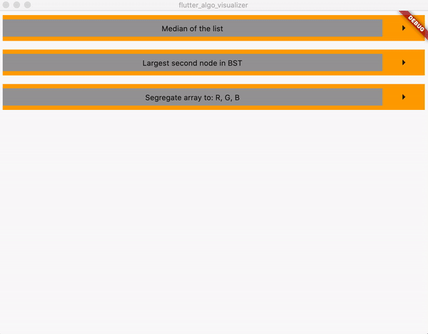

# Flutter Moldable Algorithm Runner Examples

## Getting Started

Extend class Moldable like shown in classes:

- Median
- BST
- SegregateRGB

Add instance of your class to
```
static List<Moldable> allSubclasses
```

Run the app and you will see your moldable algorithm explorer.

Example of running three moldable algorithms:



## Implemented
- *Binary Search Tree*. Find the second largest value in the BST. You can add random numbers to the tree and check how your algorithm works.
- *Segregated Array*. You can shuffle input array and then run the algorithm.
- *Median*. Watch how your algorithm works by adding random numbers to the array to count its median.


